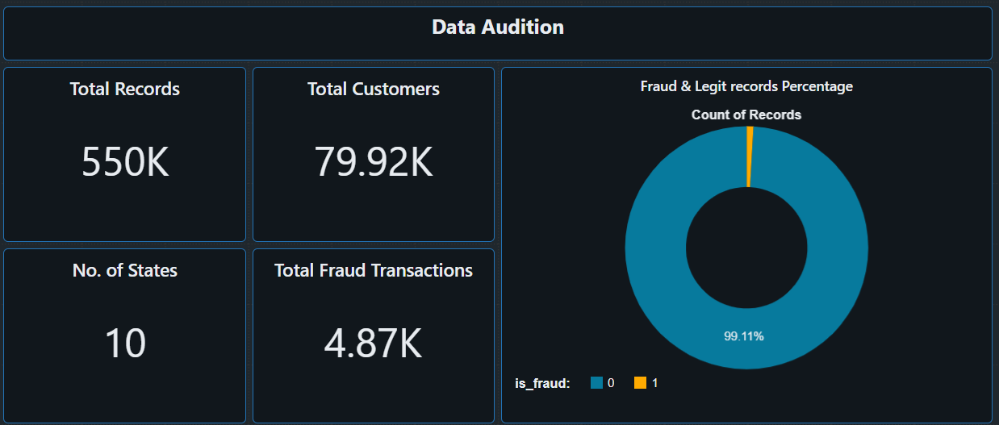
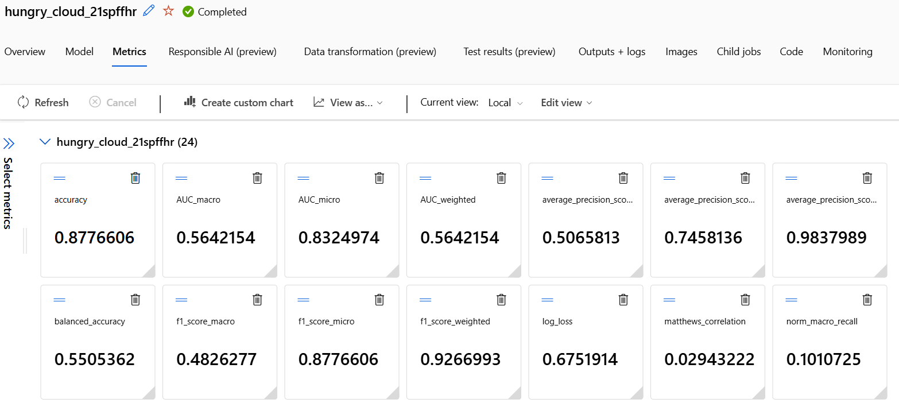
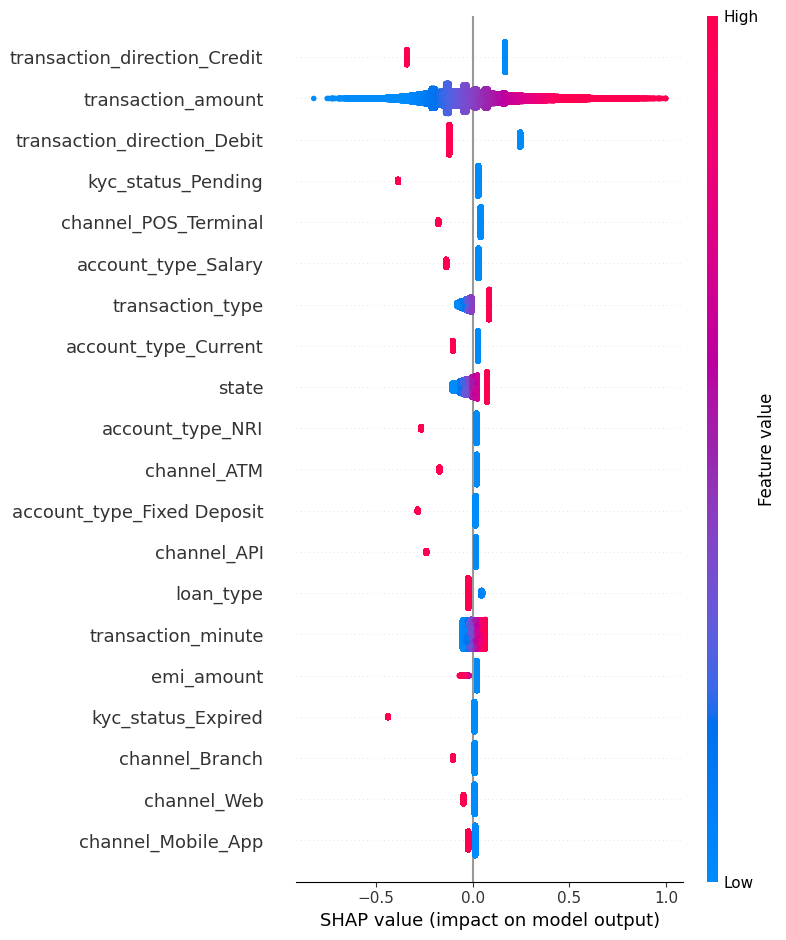

# 🔍 FinRisk360: Fraud Detection


## Transaction Fraud Detection with Azure Databricks and Azure Machine Learning

FinRisk360 is an end-to-end fraud-detection project for digital-payment transactions in the Indian financial ecosystem.

The project uses Azure Databricks for large-scale data analysis and feature engineering, then uses Azure Machine Learning Automated ML to train, compare, register, and deploy fraud-detection models.

The workflow demonstrates how a data scientist can move from raw transaction data to a deployed machine-learning service:

```text
Raw transaction data
        ↓
Azure Databricks
        ↓
Data analysis and feature engineering
        ↓
Versioned feature dataset
        ↓
Azure Machine Learning AutoML
        ↓
Model evaluation and MLflow tracking
        ↓
Azure ML model registry
        ↓
Managed online endpoint
        ↓
Fraud-risk prediction API
        ↓
Streamlit application
```

> This is a research and portfolio project based on a limited dataset. It is not a production banking system and must not be used for real financial decisions without extensive validation, security review, governance, and regulatory approval.

---

## Business Problem

Digital-payment fraud can occur through multiple channels, including:

- UPI.
- Internet banking.
- IMPS.
- NEFT.
- RTGS.
- Debit cards.
- Credit cards.
- Mobile wallets.

Banks and fintech companies need to identify suspicious transactions quickly while avoiding unnecessary declines of legitimate customer payments.

FinRisk360 aims to support fraud operations by:

1. Identifying suspicious transactions.
2. Estimating fraud probability.
3. Prioritizing transactions for investigation.
4. Providing explainable risk signals.
5. Supporting real-time scoring through an Azure ML endpoint.

The system is designed as a decision-support tool, not an autonomous financial-decision system.

---

## Project Objectives

- Analyze large-scale transaction data using Azure Databricks and Apache Spark.
- Clean and validate financial transaction data.
- Engineer behavioral, transaction, customer, and risk-related features.
- Track Databricks processing and experiments with MLflow where required.
- Use Azure Machine Learning AutoML for model experimentation.
- Compare candidate fraud-detection models.
- Register the approved model in Azure Machine Learning.
- Deploy the model to an Azure ML managed online endpoint.
- Classifies Fraud/Legit transactions.
- Provide model explanations using SHAP.
- Demonstrate an end-to-end cloud MLOps workflow.

---

## Architecture

```text
                    ┌─────────────────────┐
                    │ Raw Transaction Data│
                    └──────────┬──────────┘
                               │
                               ▼
                    ┌─────────────────────┐
                    │ Azure Storage       │
                    │ Data Lake / Blob    │
                    └──────────┬──────────┘
                               │
                               ▼
                    ┌──────────────────────┐
                    │ Azure Databricks     │
                    │                      │
                    │ - Data validation    │
                    │ - EDA                │
                    │ - Spark processing   │
                    │ - Feature engineering│
                    └──────────┬───────────┘
                               │
                               ▼
                    ┌─────────────────────┐
                    │ Versioned Feature   │
                    │ Dataset             │
                    └──────────┬──────────┘
                               │
                               ▼
                    ┌─────────────────────┐
                    │   Azure ML AutoML   │
                    │                     │
                    │ - Model search      │
                    │ - Model comparison  │
                    │ - Evaluation        │
                    └──────────┬──────────┘
                               │
                               ▼
                    ┌─────────────────────┐
                    │ Azure ML + MLflow   │
                    │ Experiment Tracking │
                    └──────────┬──────────┘
                               │
                               ▼
                    ┌─────────────────────┐
                    │ Azure ML Model      │
                    │ Registry            │
                    └──────────┬──────────┘
                               │
                               ▼
                    ┌─────────────────────┐
                    │ Managed Online      │
                    │ Endpoint            │
                    └──────────┬──────────┘
                               │
                 ┌─────────────┴─────────────┐
                 ▼                           ▼
       ┌──────────────────┐         ┌──────────────────┐
       │ Streamlit  App   │         │ REST/API Client  │
       └──────────────────┘         └──────────────────┘
```

---

## Technology Stack

### Data engineering and analysis

- Azure Databricks.
- Apache Spark.
- PySpark.
- Python.
- SQL.
- pandas.

### Machine learning

- Azure Machine Learning AutoML.
- scikit-learn.
- XGBoost or other AutoML-selected models.
- SHAP.
- Precision–recall analysis.
- Cost-sensitive threshold selection.

### Experiment tracking and MLOps

- MLflow in Azure Databricks for Databricks-side experiments, where required.
- MLflow in Azure Machine Learning for AutoML experiment tracking and final model lineage.
- Azure ML model registry.
- Azure ML managed online endpoint.
- GitHub for source control.
- GitHub Actions for basic testing.

### Application

- Streamlit.
- REST API.
- JSON input and output.

---

## About Dataset

🏦 Indian Banking Transactions Dataset - Data Dictionary From Kaggle.com
[Link_to_the_dataset](https://www.kaggle.com/datasets/belbino/indian-banking-transactions-20192024)

Dataset Overview

|Property |	Value|
|---|---:|
|Rows	|550,000|
|Columns |	20|
|Date Range	| 2019-01-01 → 2024-01-01 (5 Years)|
|Domain	| Retail Banking / Financial Transactions|
|Target Variable |	is_fraud|
|Fraud Rate	| ~0.89% (realistic class imbalance) |
|Geography |	India (10 major states) |


---

## Data Processing in Azure Databricks

Azure Databricks is used for big-data analysis and feature engineering.

### Processing workflow

```text
Raw data
   ↓
Schema validation
   ↓
Data-quality checks
   ↓
Duplicate removal
   ↓
Missing-value handling
   ↓
Leakage review
   ↓
Feature engineering
   ↓
Feature dataset output
```

### Data-quality checks

The Databricks workflow checks:

- Column names and data types.
- Missing values.
- Duplicate transactions.
- Invalid numerical values.
- Unexpected categorical values.
- Fraud-label consistency.
- Identifier uniqueness.
- Class distribution.
- Feature availability at prediction time.

### Engineered features

Examples include:

```text
amount_to_average_ratio
prior_trancastion_count
```

Every engineered feature is reviewed for:

- Business meaning.
- Availability at decision time.
- Target leakage.
- Missing values.
- Extreme values.
- Production usability.

---

## MLflow Strategy

MLflow is used with azure automl.


It tracks:

- AutoML runs.
- Candidate models.
- Parameters.
- Metrics.
- Validation results.
- Feature schema.
- Model artifacts.
- Dataset version.
- Model version.
- Deployment metadata.

### Model registry decision

The final approved model is registered in the Azure Machine Learning model registry.

The same final model is not registered separately in multiple registries unless there is a specific organizational requirement.

The simplified lifecycle is:

```text
Databricks MLflow
        ↓
Track data and feature engineering
        ↓
Azure ML data asset
        ↓
Azure ML MLflow
        ↓
Track AutoML experiments
        ↓
Azure ML model registry
        ↓
Azure ML endpoint
```
---

## Azure Machine Learning AutoML

The engineered feature dataset is registered as an Azure ML data asset and used as input for AutoML.

### AutoML workflow

```text
Versioned feature dataset
        ↓
Azure ML classification AutoML job
        ↓
Candidate model training
        ↓
Metric comparison
        ↓
Best-model selection
        ↓
SHAP and error analysis
        ↓
Model registration
```

### Evaluation metrics

The project evaluates:

- Fraud precision.
- Fraud recall.
- F1-score.
- Confusion matrix.
- False-positive rate.

Accuracy is not used as the only success metric because fraud detection is usually an imbalanced classification problem.

### Results

Replace the placeholders below with actual values:

| Model |  Precision | Recall | F1-score |
|---|---:|---:|---:|
| Baseline Logistic Regression | `0.02` | `0.15` | `0.03` |
| AutoML Best Model | `0.016` | `0.21` | `0.035` |

---

---

## Explainability

SHAP is used to explain global model behavior and individual predictions.

SHAP values describe features that influenced the model prediction. They should not be interpreted as proof that a feature caused fraud.

---

## Azure ML Deployment

The approved model is deployed to an Azure ML managed online endpoint for real-time inference.

```text
Registered model
        ↓
Scoring script
        ↓
Environment
        ↓
Managed online endpoint
        ↓
REST prediction request
```

Azure ML managed online endpoints are used for real-time model inference and deployment management. [165]

---

## Streamlit Dashboard

The dashboard provides an analyst-style interface with:

### Transaction scoring

- Transaction input form.
- Transaction classification

### Model performance

- Precision.
- Recall.
- Confusion matrix.
- SHAP feature importance.


### Run locally

```bash
streamlit run streamlit_app.py
```

---

## Repository Structure

```text
finrisk360/
├── data/
│   └── README.md
├── databricks/
│   ├── notebooks/
│   │   ├── 01_data_audit.py
│   │   ├── 02_feature_engineering.py
│   │   └── feature_engineering.md
│   ├── scripts/
│   │   └── 03_export_features.py
│   └── README.md
├── azureml/
│   ├── data_asset/
│   │   ├── test_dataset.yml
│   │   ├── train_dataset.yml
│   │   └── val_dataset.yml
│   ├── mlflow_artifacts
│   └── notebook/
|       ├──automl_jon.ipynb
|       └──model_shap_exp.ipynb
├── src/
│   ├── validation.py
│   ├── preprocess.py
│   ├── evaluate.py
│   └── feature_engineering.py
├── dashboard/
│   └── data_audit_EDA.lvdash.json   > databricks dashboards
├── tests/
│   └── tendpoint_test.ipynb
├── assets/
│   ├── automl_metrics.png
│   └── shap_exp.png
├── .gitignore
├── requirements.txt
└── README.md
```


---

## Limitations

This project is a proof of concept.

Known limitations include:

- The dataset is limited in size.
- The dataset may be synthetic or simulated.
- The fraud distribution may not match real production traffic.
- Precomputed risk features may introduce target leakage.
- A reliable transaction timestamp may not be available.
- The model has not been validated on live banking data.
- The model may not generalize to other banks, customers, or payment platforms.
- No production financial decision should be made solely from this model.
- Real deployment would require privacy, security, fairness, governance, monitoring, and regulatory review.


---

## Learning Outcomes

This project demonstrates experience with:

- Azure Databricks.
- Apache Spark.
- PySpark.
- SQL.
- Big-data analysis.
- Feature engineering.
- Data validation.
- Fraud detection.
- Imbalanced classification.
- Precision–recall evaluation.
- Leakage analysis.
- AutoML.
- MLflow.
- Azure Machine Learning.
- Model registration.
- Online endpoint deployment.
- SHAP explainability.
- Streamlit.
- GitHub.
- MLOps fundamentals.

---
## Project Snapshots
### Data Audit Databricks Dashbord 

### Azureml automl model metrics

### Model SHAP Explaination Beesworm plot 


## Author

**Durrain khan Pathan**

- GitHub: [DURRAINk](https://github.com/DURRAINk)
- LinkedIn: [Durrain Khan](https://www.linkedin.com/in/durrain-khan-pathan-728762304/?isSelfProfile=true)
- Email: `durrainpathan123@gmial.com`

---

Thank You!
---


